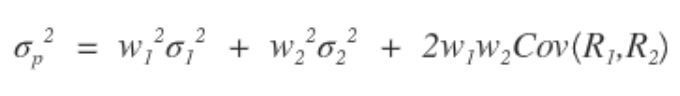
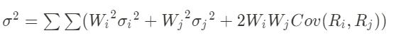
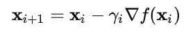
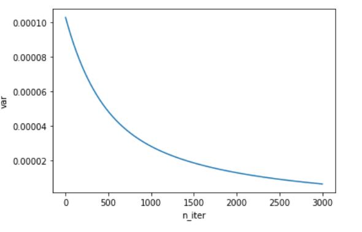
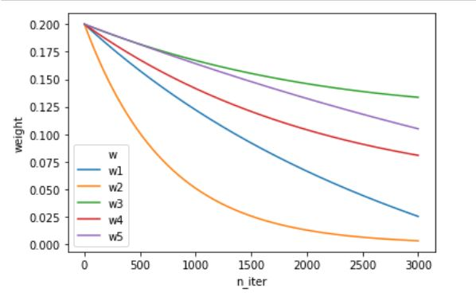
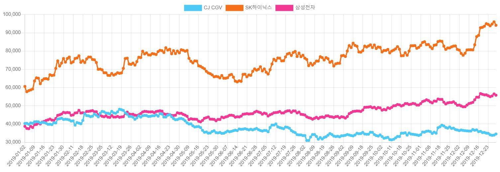
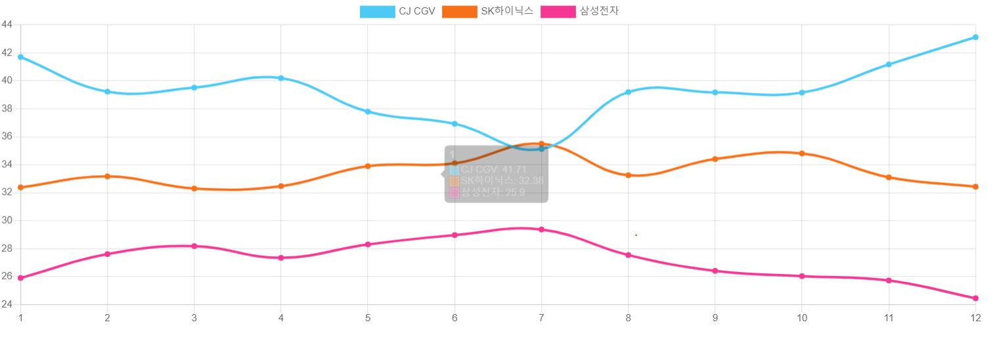

# MVAR 프로젝트

## 문제

주식의 포트폴리오를 작성할 때 각각의 주식에 어떤 비율로 투자할 것인지를 결정하기가 어렵다. 대체적으로 분산이 최소화 되는 비율을 고를 때 가장 안정적인 투자를 할 수 있는것으로 알려져 있다. 하지만 포트폴리오 분산을 구하는 공식을 보면 2변수의 분산만을 구할 수 있다. 또한 주식 종목이 2개를 초과할 경우의 분산의 최소값을 얻는 것은 많은 양의 계산을 요구한다. 

## 문제 해결 방법

위의 문제를 해결하기위해 경사하강법을 사용하는 모델을 이용해 w 값의 최소값을 구해내는 방식을 생각했으나, 주식 포트폴리오의 비율에 label이 될 수 있는 값이 존재하지 않아 지도학습은 사용할수 가 없었다. 그래서 직접 loss 함수를 만들고 이를 미분하여 분산값이 최소화 되는 w 값을 학습해 나가는 코드를 짜기로 하였다. loss 함수는 아래와 같이 구성하였다.

결국 분산의 최소값을 구해야 하는 것임으로 모든 2변수 조합의 분산을 구하는 공식을 모두 더하면 된다. 그 다음 모든 W 에 대하여  편미분하여 아래의 경사하강 공식을 사용하여 분산의 값을 줄여나갈 수 있다.

이터레이션을 반복함에 따라 아래와 같이 분산값이 점차 내려가는 결과를 얻을 수 있다.

y 축이 분산, x 축이 이터레이션 횟수이다.

아래는 분산이 내려감에 따라 변수들 역시 줄어드는 것을 볼 수 있다.

여기서 문제가 발생하는데 W 값이 분산이 줄어듬과 동시에 같이 줄어든다는 점이었다. 그래서 실제로 얻어지는 W 값 대신에 각각의 W 값을 모두 더한 뒤에 ${W_i}$ 가 전체에서 차지하는 비율을 ${W_i}$ 값으로 삼아 포트폴리오의 비율을 측정했다. 

## 결과

n개의 주식의 분산을 최소화 한다는 기존의 목적은 이룰 수 있었다. 하지만 하이퍼 파라미터에 따라 그리고 주식의 가격의 차이에 따라, 가격이 높을 경우 크게 변동해도 분산이 크지 않다는점, 반면 가격이 낮을 경우 약간의 가격차이만 나도 분산이 커지는 경우가 있었다.  예를 들자면아래의 그래프에서 주황생 그래프인 sk하이닉스 값이 크게 요동치는것처럼 보이지만 실제 비율은 중간에 머물고 있는 것을 볼 수 있다.  또한 분산은 어디까지나 변동의 정도이지 상승과 하강을 분리하지 못한다는 점은 보완해야 할 점이다.

